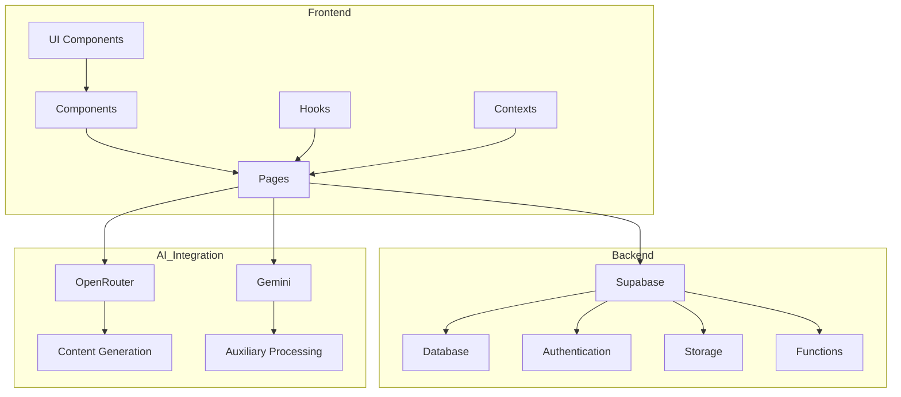
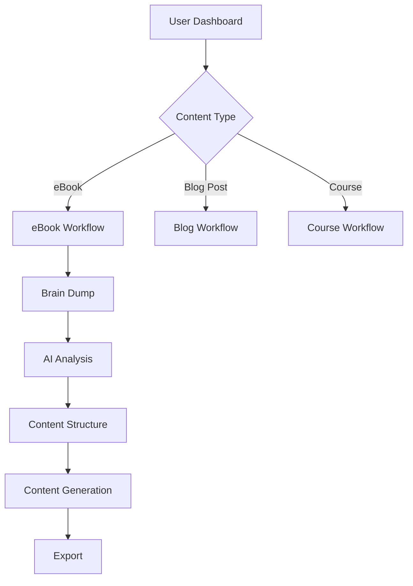
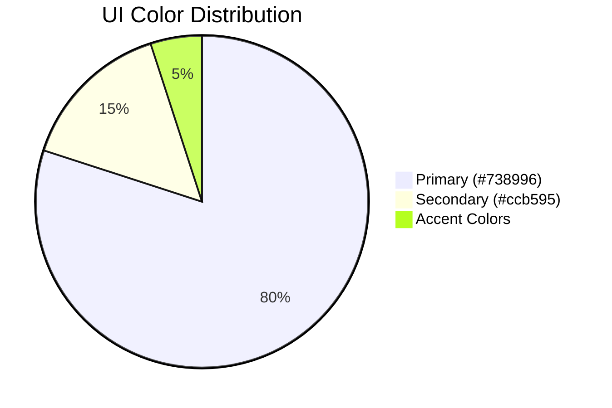
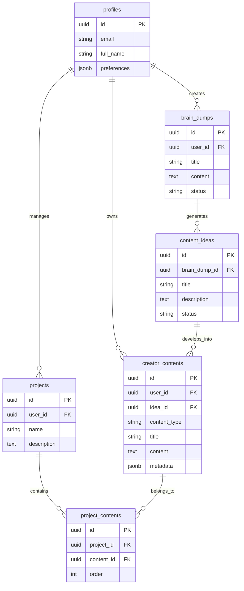
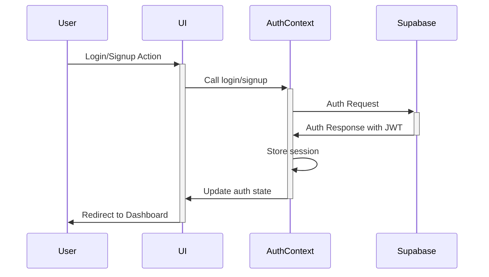

# CLAUDE.md - AutopenV3 Project Guide

## Commands
- Build: `npm run build` (TypeScript + Vite)
- Dev server: `npm run dev` (Vite dev server)
- Lint: `npm run lint` (ESLint)
- Preview: `npm run preview` (Preview built app locally)
- TypeCheck: `tsc` (TypeScript check)
- Update Supabase Types: `npm run types:supabase`
- Apply Schema: `npm run apply:creator-contents`

## Project Architecture



## Code Organization

- **/src/components/** - Feature-based UI components
  - **/auth/** - Authentication components
  - **/creator/** - Content creation interface
  - **/dashboard/** - Dashboard and user workspace
  - **/layout/** - Layout components and navigation
  - **/pages/** - Page-level components
  - **/ui/** - Reusable UI components (shadcn/ui)
  - **/workflow/** - Workflow implementation components

- **/src/lib/** - Utilities and core functionality
  - **/contexts/** - React context providers
  - **/utils/** - Helper functions

- **/src/hooks/** - Custom React hooks
- **/src/types/** - TypeScript type definitions
- **/supabase/** - Supabase configuration and functions

## Workflows

The application is built around several key workflows:



### eBook Workflow

1. **Input Step**: Title, description, target audience
2. **Brain Dump**: Content ideas, references, research
3. **Chapters Definition**: Structure and outline
4. **Content Generation**: AI-assisted chapter writing
5. **Introduction/Conclusion**: Final elements
6. **PDF Generation**: Export to downloadable format

## Code Style Guidelines
- **TypeScript**: Use explicit types even though strict mode is off
- **Components**: Functional components with hooks, React Context for global state
- **Imports**: Group by 1)external 2)internal 3)types, use @/* paths when possible
- **Naming**: PascalCase for components/types, camelCase for variables/functions
- **Styling**: Tailwind with shadcn/ui components, use existing utility classes
- **Error Handling**: Try/catch with specific error types for async operations
- **Architecture**: Feature-based directory structure (/components/feature/)
- **Forms**: Use react-hook-form with zod validation
- **Database**: Supabase with proper Row Level Security (RLS)

## Component Development Pattern

```typescript
// Import structure
import { useState, useEffect } from 'react'; // React imports
import { Button, Card } from '@/components/ui'; // Internal components
import { useAuth } from '@/lib/contexts/AuthContext'; // Contexts
import type { ContentType } from '@/types/database.types'; // Types

// Component definition
export function FeatureComponent({ 
  prop1, 
  prop2 
}: FeatureComponentProps) {
  // State management
  const [data, setData] = useState<DataType | null>(null);
  const { user } = useAuth();
  
  // Side effects
  useEffect(() => {
    // Effect implementation
  }, [dependencies]);
  
  // Event handlers
  const handleAction = async () => {
    try {
      // Implementation
    } catch (error) {
      // Error handling
    }
  };
  
  // Component rendering
  return (
    <div className="feature-container">
      {/* Component JSX */}
    </div>
  );
}

// Type definitions
interface FeatureComponentProps {
  prop1: string;
  prop2?: number;
}
```

## Design System

- **Colors**: Primary=#738996 (blue, 80% of UI), Secondary=#ccb595 (yellow, 20% of UI)
- **Components**: Use existing utility classes (.textera-*) for consistent styling
- **Typography**: Georgia for headings/body, Inter for technical content
- **Layout**: Enhanced padding (min 16px), consistent spacing (0.25rem increments)

### Color Usage



### Typography Scale

| Element | Font | Size | Weight | Line Height |
|---------|------|------|--------|-------------|
| h1 | Georgia | 2.5rem | 700 | 1.2 |
| h2 | Georgia | 2rem | 700 | 1.2 |
| h3 | Georgia | 1.5rem | 600 | 1.25 |
| Body | Georgia | 1rem | 400 | 1.5 |
| Technical | Inter | 0.875rem | 400 | 1.5 |

## Database Schema



## Supabase Integration

### Authentication Flow



### RLS Policies

All tables implement Row Level Security (RLS) to ensure users can only access their own data:

```sql
-- Example RLS policy pattern
CREATE POLICY "Users can only access their own data"
ON table_name
FOR ALL
USING (auth.uid() = user_id);
```

## Best Practices

- Keep components small and focused on a single responsibility
- Follow React's rules of hooks and proper error handling
- Maintain consistent styling using the design system
- Leverage existing shadcn/ui components with custom overrides
- Always handle loading and error states in UI components
- Use Supabase queries with proper error handling and RLS awareness
- Implement proper TypeScript types for all database operations
- Follow the established workflow patterns for new features

## AI Integration Guidelines

- OpenRouter API is used for primary content generation
- Proper prompt engineering is critical for quality results
- Always implement retry logic and error handling
- Cache results when possible to reduce API costs
- Respect token limits and implement chunking for large content
- Use streaming responses for better UX during generation
- Apply post-processing to ensure consistent formatting

## Common Issues & Solutions

1. **Database Schema Errors**: Run migration scripts via `npm run apply:creator-contents`
2. **Auth Issues**: Check Supabase configuration in `.env` file
3. **Type Errors**: Run `npm run types:supabase` to update database types
4. **UI Inconsistencies**: Refer to the design system and shadcn/ui documentation
5. **Performance Issues**: Implement proper data fetching strategies with SWR/React Query