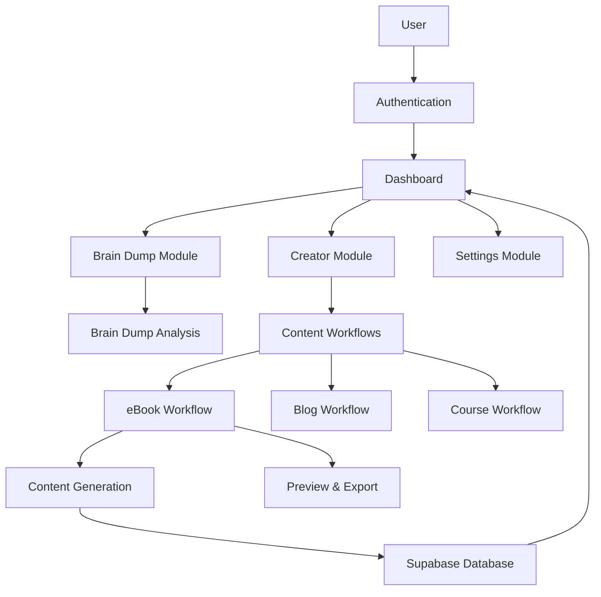
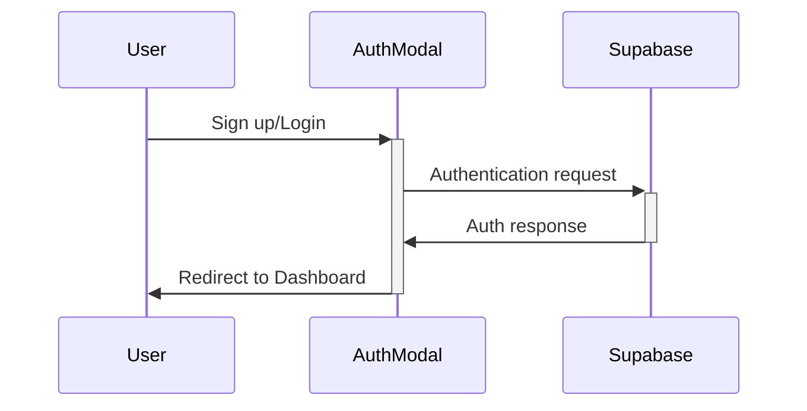
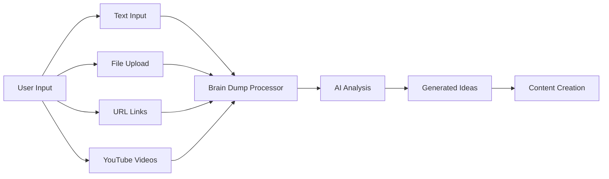
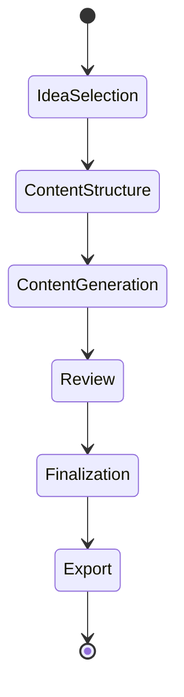
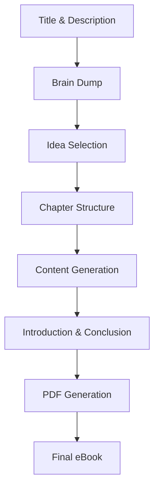
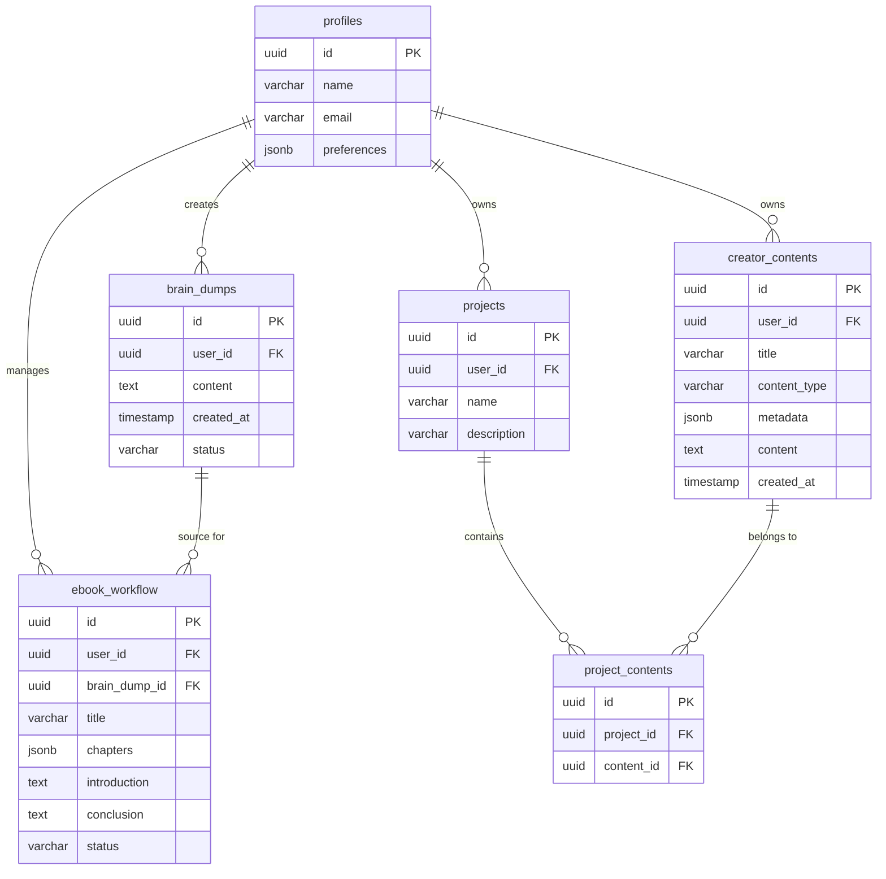
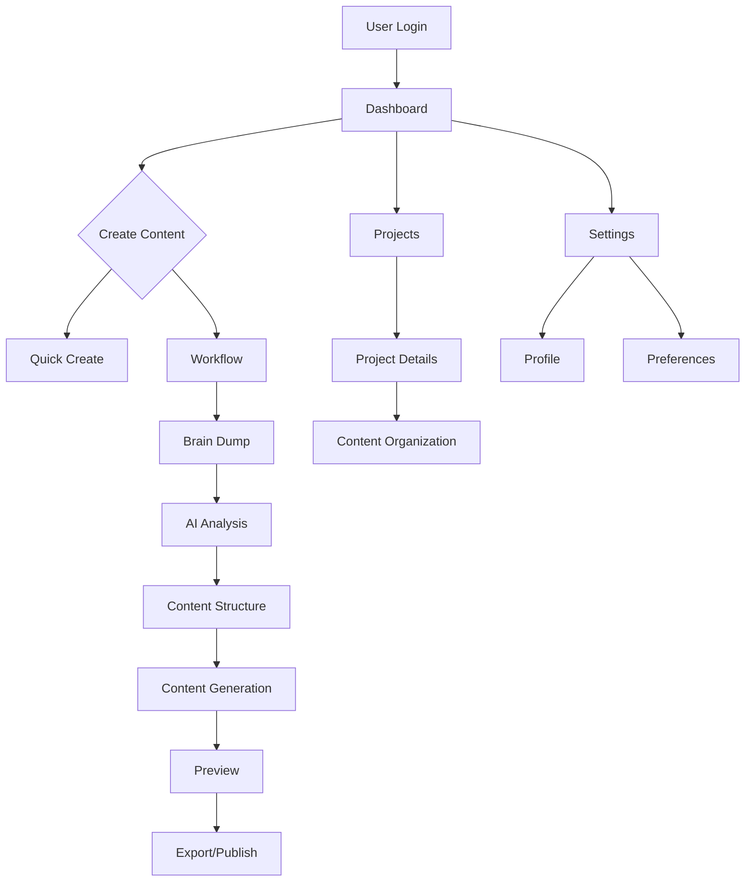

# AutopenV3: AI-Powered Content Creation Platform

AutopenV3 is a comprehensive content creation platform that leverages AI to streamline the process of creating high-quality content including eBooks, blog posts, and courses. The platform features a workflow-based architecture, rich user interactions, and seamless AI integration.

## Architecture Overview



### Technology Stack

- **Frontend**: React, TypeScript, Vite
- **UI Components**: shadcn/ui with Tailwind CSS
- **Backend & Database**: Supabase (PostgreSQL)
- **Authentication**: Supabase Auth
- **File Storage**: Supabase Storage
- **AI Integration**: OpenRouter API, Google Gemini

## Module Overview

### Authentication
User authentication and authorization managed through Supabase Auth with custom UI integration.



### Dashboard
Central hub for user activities with personalized content display and navigation.

### Brain Dump
Ideation and content analysis module that processes user input and generates content ideas.



### Content Creator
Workflow-based system for creating different types of content.



### eBook Workflow
Specialized workflow for creating complete eBooks.



## Database Structure



## Getting Started

### Prerequisites
- Node.js 18+
- npm 8+
- Supabase account

### Environment Setup
Create a `.env` file with the following variables:
```
# Supabase Configuration
VITE_SUPABASE_URL=your_supabase_url
VITE_SUPABASE_ANON_KEY=your_supabase_anon_key
VITE_SUPABASE_SERVICE_ROLE_KEY=your_service_role_key

# OpenRouter Configuration - Required for AI features
VITE_OPENROUTER_API_KEY=your_openrouter_api_key  # Get from https://openrouter.ai/
VITE_OPENROUTER_MODEL=deepseek/deepseek-r1:free  # Default model to use
VITE_OPENROUTER_API_URL=https://openrouter.ai/api/v1/chat/completions  # API endpoint

# Other Services (optional)
VITE_GEMINI_API_KEY=your_gemini_api_key  # Only needed if using Google Gemini
```

You can copy the `.env.example` file to get started:
```bash
cp .env.example .env
```

Then edit the file to add your API keys. **You must add a valid OpenRouter API key** for the eBook idea generation functionality to work.

### Database Setup

#### Applying Schema Migrations

If you encounter a database error like "relation 'creator_contents' does not exist", you need to apply the necessary database migrations. There are several ways to do this:

1. **Using Supabase CLI** (recommended):
   ```bash
   npx supabase migration up
   ```

2. **Using the provided script**:
   ```bash
   npm run apply:creator-contents
   ```
   This script requires environment variables `VITE_SUPABASE_URL` and `VITE_SUPABASE_SERVICE_ROLE_KEY` to be set.

3. **Manual SQL execution**:
   You can manually execute the SQL in the migration files through the Supabase dashboard SQL editor.

#### Fixing Database Schema Issues

If you encounter errors related to missing columns like `column projects.metadata does not exist` or an infinite loop of database requests when viewing products, you need to apply a schema fix:

1. **Using the provided script**:
   ```bash
   npm run fix:metadata-column
   ```
   This requires `SUPABASE_URL` and `SUPABASE_SERVICE_KEY` environment variables in your `.env` file.

2. **Manual fix**:
   You can manually execute this SQL in the Supabase dashboard SQL editor:
   ```sql
   ALTER TABLE projects ADD COLUMN IF NOT EXISTS metadata JSONB;
   ```

For complete documentation on fixing database issues, see the [Database Fix Guide](./docs/DATABASE_FIX.md).

### Installation & Development

1. Install dependencies:
   ```bash
   npm install
   ```

2. Start the development server:
   ```bash
   npm run dev
   ```

3. Build for production:
   ```bash
   npm run build
   ```

## Development Workflow


## Commands Reference

- Build: `npm run build` (TypeScript + Vite)
- Dev server: `npm run dev` (Vite dev server)
- Lint: `npm run lint` (ESLint)
- Preview: `npm run preview` (Preview built app locally)
- TypeCheck: `tsc` (TypeScript check)
- Update Supabase Types: `npm run types:supabase`
- Apply Schema: `npm run apply:creator-contents`
- Fix Database: `npm run fix:metadata-column` (Fix missing metadata column issue)

## Application Flow



## Expanding the ESLint configuration

If you are developing a production application, we recommend updating the configuration to enable type aware lint rules:

- Configure the top-level `parserOptions` property like this:

```js
export default {
  // other rules...
  parserOptions: {
    ecmaVersion: 'latest',
    sourceType: 'module',
    project: ['./tsconfig.json', './tsconfig.node.json'],
    tsconfigRootDir: __dirname,
  },
}
```

- Replace `plugin:@typescript-eslint/recommended` to `plugin:@typescript-eslint/recommended-type-checked` or `plugin:@typescript-eslint/strict-type-checked`
- Optionally add `plugin:@typescript-eslint/stylistic-type-checked`
- Install [eslint-plugin-react](https://github.com/jsx-eslint/eslint-plugin-react) and add `plugin:react/recommended` & `plugin:react/jsx-runtime` to the `extends` list