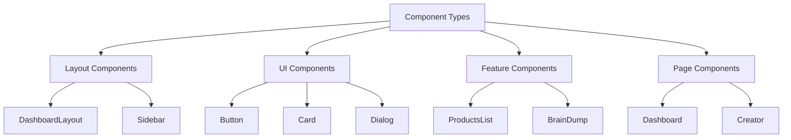

# Autopen Component Guidelines

This document provides detailed guidelines for building components in the Autopen application, focusing on composition patterns, best practices, and examples that adhere to the established UI design system.

## Component Architecture



## Component Structure

For consistency, follow this template for new components:

```typescript
// Import structure
import React, { useState, useEffect } from "react";
// 1. External dependencies
import { useNavigate } from "react-router-dom";
import { SomeIcon } from "lucide-react";

// 2. Internal components
import { Button } from "@/components/ui/button";
import { Card } from "@/components/ui/card";

// 3. Hooks and utilities
import { useAuth } from "@/supabase/auth";
import { formatDate } from "@/lib/utils";

// 4. Types
import type { ComponentType } from "@/types/components";

// Component definition with TypeScript interface
interface ExampleComponentProps {
  title: string;
  description?: string;
  items: Array<{
    id: string;
    name: string;
  }>;
  onAction: (id: string) => void;
}

export function ExampleComponent({
  title,
  description,
  items = [],
  onAction,
}: ExampleComponentProps) {
  // State management
  const [activeItem, setActiveItem] = useState<string | null>(null);
  const { user } = useAuth();
  const navigate = useNavigate();
  
  // Side effects
  useEffect(() => {
    // Implementation
  }, [items]);
  
  // Event handlers
  const handleItemClick = (id: string) => {
    setActiveItem(id);
    onAction(id);
  };
  
  // Render helpers
  const renderItem = (item) => (
    <li 
      key={item.id}
      className="p-4 border-b last:border-0 hover:bg-accent-primary/5 transition-colors duration-200"
    >
      {item.name}
    </li>
  );
  
  // Component rendering with proper structure
  return (
    <Card className="border border-accent-tertiary/20 shadow-blue-sm">
      <div className="p-6 border-b border-accent-tertiary/20">
        <h3 className="text-xl font-display font-medium text-ink-dark">
          {title}
        </h3>
        {description && (
          <p className="mt-1 text-ink-light font-serif">
            {description}
          </p>
        )}
      </div>
      
      <div className="p-6">
        {items.length === 0 ? (
          <div className="py-8 text-center text-ink-light">
            No items found
          </div>
        ) : (
          <ul>
            {items.map(renderItem)}
          </ul>
        )}
      </div>
      
      <div className="px-6 pb-6 pt-2 flex justify-end">
        <Button onClick={() => navigate('/add-item')}>
          <SomeIcon className="w-4 h-4 mr-2" />
          Add Item
        </Button>
      </div>
    </Card>
  );
}
```

## Card Compositions

Cards are a key building block in the Autopen UI. Here are patterns for common card compositions:

### Basic Content Card

```jsx
<Card className="border border-[#E8E8E8] bg-white shadow-sm hover:shadow-md transition-all duration-300">
  <CardHeader className="pb-3 pt-5 px-6 border-b border-[#F0F0F0]">
    <div className="flex items-center">
      <FileText className="w-5 h-5 text-[#738996] mr-2" />
      <CardTitle className="text-lg font-medium font-serif">Content Title</CardTitle>
    </div>
  </CardHeader>
  <CardContent className="px-6 py-5">
    <p className="text-[#666666] font-serif">Main content goes here.</p>
    
    {/* Optional footer with actions */}
    <div className="mt-6 pt-4 border-t border-[#F0F0F0] flex justify-end gap-4">
      <Button variant="outline">Cancel</Button>
      <Button>Save</Button>
    </div>
  </CardContent>
</Card>
```

### Interactive List Card

```jsx
<Card>
  <CardHeader>
    <CardTitle>List Title</CardTitle>
    <CardDescription>Optional description text</CardDescription>
  </CardHeader>
  <CardContent className="p-0">
    <div className="divide-y divide-accent-tertiary/20">
      {items.map(item => (
        <div 
          key={item.id}
          className="p-4 hover:bg-accent-primary/5 transition-colors duration-200 cursor-pointer flex justify-between items-center"
          onClick={() => handleItemClick(item.id)}
        >
          <div>
            <h4 className="font-medium text-ink-dark">{item.title}</h4>
            <p className="text-sm text-ink-light">{item.description}</p>
          </div>
          <ChevronRight className="w-4 h-4 text-ink-light" />
        </div>
      ))}
    </div>
  </CardContent>
  <CardFooter className="border-t border-accent-tertiary/20">
    <Button variant="ghost" className="ml-auto">View All</Button>
  </CardFooter>
</Card>
```

### Stat Card with Indicator

```jsx
<Card className="border border-[#E8E8E8] bg-gradient-to-br from-white to-[#F9F7F4] shadow-sm rounded-lg overflow-hidden hover:border-[#738996] hover:shadow-md transition-all duration-300">
  <CardContent className="p-0">
    <div className="flex flex-col p-5">
      <div className="flex items-center justify-between mb-3">
        <p className="text-[#666666] text-sm font-medium">Stat Title</p>
        <div className="w-10 h-10 bg-[#F5F5F5] rounded-full flex items-center justify-center">
          <BookText className="w-5 h-5 text-[#738996]" />
        </div>
      </div>
      <div className="flex items-baseline">
        <p className="text-[#2A2A2A] text-3xl font-serif font-medium">{value}</p>
        <div className="ml-2 text-xs text-[#738996] font-medium px-1.5 py-0.5 bg-[#738996]/10 rounded">
          {indicator}
        </div>
      </div>
    </div>
    {/* Progress bar */}
    <div className="h-1.5 w-full bg-[#738996]/10">
      <div 
        className="h-1.5 bg-[#738996] rounded-r-full transition-all duration-1000" 
        style={{ width: `${progress}%` }}
      ></div>
    </div>
  </CardContent>
</Card>
```

## Dashboard Grid Layout

For dashboard layouts, use this grid structure to maintain consistency:

```jsx
<div className="space-y-8">
  {/* Stats section - 3 column grid */}
  <div className="grid grid-cols-1 md:grid-cols-3 gap-5">
    {/* Stat cards go here */}
  </div>
  
  {/* Main content - 2 column grid */}
  <div className="grid grid-cols-1 lg:grid-cols-3 gap-7">
    {/* Left column - 2/3 width */}
    <div className="lg:col-span-2 space-y-7">
      {/* Primary content cards */}
    </div>
    
    {/* Right column - 1/3 width */}
    <div className="lg:col-span-1 space-y-7">
      {/* Secondary content cards */}
    </div>
  </div>
  
  {/* Full width section */}
  <div className="w-full">
    {/* Full width content */}
  </div>
</div>
```

## Button Compositions

### Standard Buttons

```jsx
// Primary action button
<Button className="bg-[#738996] text-white hover:bg-[#738996]/90">
  <PlusIcon className="w-4 h-4 mr-2" />
  Create New
</Button>

// Secondary action button
<Button variant="outline" className="border-accent-tertiary/30 text-ink-dark">
  Cancel
</Button>

// Gold CTA button
<Button className="bg-[#ccb595] text-white hover:bg-[#ccb595]/90 shadow-yellow-sm">
  <Wand2 className="w-4 h-4 mr-2" />
  Generate with AI
</Button>
```

### Button Groups

```jsx
<div className="flex gap-3">
  <Button variant="outline">Cancel</Button>
  <Button>Save</Button>
</div>

// For toggle button groups
<div className="inline-flex rounded-md border border-accent-tertiary/30 p-0.5 bg-accent-tertiary/5">
  <Button 
    variant="ghost"
    className={activeTab === 'tab1' 
      ? "bg-white shadow-sm" 
      : "bg-transparent hover:bg-accent-tertiary/10"
    }
    onClick={() => setActiveTab('tab1')}
  >
    Tab 1
  </Button>
  <Button 
    variant="ghost"
    className={activeTab === 'tab2' 
      ? "bg-white shadow-sm" 
      : "bg-transparent hover:bg-accent-tertiary/10"
    }
    onClick={() => setActiveTab('tab2')}
  >
    Tab 2
  </Button>
</div>
```

## Form Components

### Input Fields

```jsx
<div className="space-y-1.5">
  <Label htmlFor="name" className="text-sm font-medium text-ink-dark">
    Name
  </Label>
  <Input 
    id="name"
    placeholder="Enter your name" 
    className="border-accent-tertiary/30 focus:border-accent-primary focus:ring-accent-primary/10"
  />
  <p className="text-xs text-ink-light mt-1">
    This will be displayed on your profile
  </p>
</div>
```

### Form Layout

```jsx
<form onSubmit={handleSubmit}>
  <div className="space-y-6">
    <div className="grid grid-cols-1 md:grid-cols-2 gap-x-6 gap-y-4">
      <div className="space-y-1.5">
        <Label htmlFor="firstName">First Name</Label>
        <Input id="firstName" />
      </div>
      <div className="space-y-1.5">
        <Label htmlFor="lastName">Last Name</Label>
        <Input id="lastName" />
      </div>
    </div>
    
    <div className="space-y-1.5">
      <Label htmlFor="email">Email</Label>
      <Input id="email" type="email" />
    </div>
    
    <div className="space-y-1.5">
      <Label htmlFor="bio">Bio</Label>
      <Textarea 
        id="bio" 
        placeholder="Tell us about yourself"
        className="min-h-[120px]"
      />
    </div>
    
    <div className="pt-4 border-t border-accent-tertiary/20 flex justify-end gap-3">
      <Button type="button" variant="outline">Cancel</Button>
      <Button type="submit">Save Changes</Button>
    </div>
  </div>
</form>
```

## Navigation Components

### Header

```jsx
<header className="h-[68px] bg-[#191f25] border-b border-white/10 flex items-center px-8 sticky top-0 z-50 w-full shadow-md">
  <div className="flex items-center">
    <PenTool className="w-7 h-7 text-accent-yellow" />
    <span className="font-display text-2xl ml-2.5 text-white tracking-tight">Autopen</span>
  </div>
  
  {/* Center title - only on larger screens */}
  <div className="hidden md:block absolute left-1/2 transform -translate-x-1/2">
    <h1 className="font-display text-2xl text-white tracking-tight">{pageTitle}</h1>
  </div>
  
  <div className="flex-1"></div>
  
  {/* Right side navigation */}
  <div className="flex items-center gap-3">
    <Button 
      variant="outline" 
      size="sm" 
      className="text-white border-white/30 hover:bg-white/15 bg-transparent"
    >
      <PlusIcon className="w-4 h-4 mr-2" />
      New
    </Button>
    <UserNavDropdown />
  </div>
</header>
```

### Sidebar Navigation

```jsx
<aside className="w-56 bg-white border-r border-accent-tertiary/20 h-screen sticky top-[68px]">
  <div className="flex flex-col h-full py-4">
    <div className="px-3">
      <nav className="space-y-1">
        {navItems.map((item) => (
          <Button
            key={item.label}
            variant="ghost"
            className={cn(
              "w-full justify-start text-sm font-serif",
              activeTab === item.label
                ? "bg-accent-primary/10 text-ink-dark font-medium"
                : "text-ink-light hover:bg-accent-primary/5 hover:text-ink-dark"
            )}
            onClick={() => navigate(item.href)}
          >
            <div className={activeTab === item.label ? "text-accent-primary" : "text-ink-light"}>
              {item.icon}
            </div>
            <span className="ml-3">{item.label}</span>
          </Button>
        ))}
      </nav>
    </div>
    
    {/* Bottom section */}
    <div className="mt-auto px-3">
      <div className="pt-4 border-t border-accent-tertiary/20">
        <Button
          variant="ghost"
          className="w-full justify-start text-sm font-serif text-ink-light hover:bg-accent-primary/5 hover:text-ink-dark"
          onClick={() => navigate('/settings')}
        >
          <Settings className="text-ink-light" />
          <span className="ml-3">Settings</span>
        </Button>
      </div>
    </div>
  </div>
</aside>
```

## Empty States

```jsx
<div className="py-10 flex flex-col items-center justify-center text-center">
  <div className="w-16 h-16 bg-[#F5F5F5] rounded-full flex items-center justify-center mb-4">
    <FileText className="w-8 h-8 text-[#CCCCCC]" />
  </div>
  <h3 className="text-xl font-medium text-ink-dark mb-2">No Content Yet</h3>
  <p className="text-[#666666] max-w-md mx-auto mb-6">
    Get started by creating your first content or exploring templates
  </p>
  <div className="flex gap-3">
    <Button 
      variant="outline"
      onClick={() => navigate('/templates')}
    >
      Browse Templates
    </Button>
    <Button 
      onClick={() => navigate('/create-content')}
    >
      <PlusIcon className="w-4 h-4 mr-2" />
      Create Content
    </Button>
  </div>
</div>
```

## Loading States

```jsx
<div className="py-10 flex flex-col items-center justify-center">
  <Loader2 className="w-8 h-8 text-[#738996] animate-spin mb-3" />
  <p className="text-[#666666] text-sm">Loading your content...</p>
</div>
```

## Error States

```jsx
<div className="p-4 border border-red-200 rounded-lg bg-red-50 text-red-700">
  <div className="flex items-start">
    <AlertCircle className="w-5 h-5 mr-2 flex-shrink-0 mt-0.5" />
    <div>
      <h4 className="text-sm font-medium mb-1">Error loading data</h4>
      <p className="text-xs">{errorMessage}</p>
      <Button 
        onClick={handleRetry} 
        size="sm"
        className="bg-red-700 text-white hover:bg-red-800 mt-2"
      >
        <RefreshCw className="w-3 h-3 mr-1" />
        Retry
      </Button>
    </div>
  </div>
</div>
```

## List Patterns

### Interactive List

```jsx
<div className="rounded-lg border border-accent-tertiary/20 overflow-hidden">
  {items.map((item, index) => (
    <React.Fragment key={item.id}>
      <div 
        className="p-4 hover:bg-accent-primary/5 transition-colors duration-200 cursor-pointer flex justify-between items-center"
        onClick={() => handleItemClick(item.id)}
      >
        <div className="flex items-center">
          {/* Optional icon */}
          <div className="w-10 h-10 bg-[#F5F5F5] rounded-full flex items-center justify-center mr-3 flex-shrink-0">
            <FileText className="w-5 h-5 text-[#738996]" />
          </div>
          <div>
            <h4 className="font-medium text-ink-dark mb-0.5">{item.title}</h4>
            <p className="text-sm text-ink-light">{item.description}</p>
          </div>
        </div>
        <ChevronRight className="w-4 h-4 text-ink-light" />
      </div>
      {index < items.length - 1 && (
        <div className="border-b border-accent-tertiary/20" />
      )}
    </React.Fragment>
  ))}
</div>
```

### Progress List

```jsx
<div className="rounded-lg border border-accent-tertiary/20 overflow-hidden">
  {items.map((item, index) => (
    <React.Fragment key={item.id}>
      <div className="p-4">
        <div className="flex justify-between items-start mb-3">
          <div>
            <h4 className="font-medium text-ink-dark mb-1">{item.title}</h4>
            <div className="flex items-center">
              <Badge className="bg-[#F9F5ED] text-[#ccb595] border-[#ccb595] border mr-2 font-normal px-2 py-0.5 rounded text-xs">
                {item.category}
              </Badge>
              <span className="text-xs text-[#666666]">
                Updated {formatRelativeDate(item.updatedAt)}
              </span>
            </div>
          </div>
          <Button variant="ghost" size="sm" className="p-1.5 hover:bg-accent-primary/10 rounded-full" onClick={() => handleItemClick(item.id)}>
            <ChevronRight className="w-4 h-4 text-accent-primary" />
          </Button>
        </div>
        <div className="w-full bg-[#E8E8E8] rounded-full h-1.5 mb-1">
          <div 
            className="bg-[#738996] h-1.5 rounded-full transition-all duration-1000" 
            style={{ width: `${item.progress}%` }}
          ></div>
        </div>
        <div className="flex justify-between text-xs">
          <span className="text-[#666666]">Progress</span>
          <span className="text-[#2A2A2A] font-medium">{item.progress}%</span>
        </div>
      </div>
      {index < items.length - 1 && (
        <div className="border-b border-accent-tertiary/20" />
      )}
    </React.Fragment>
  ))}
</div>
```

## Best Practices

1. **Component Naming**
   - Use PascalCase for component names
   - Use descriptive, clear names that indicate the component's purpose
   - Prefix related components (e.g., `UserCard`, `UserAvatar`, `UserStats`)

2. **Props**
   - Define explicit TypeScript interfaces for all props
   - Use optional props with default values where appropriate
   - Keep prop objects flat when possible, but group related props when logical

3. **State Management**
   - Use React hooks for local state
   - Keep state minimal and focused
   - Lift state up when needed for sharing between components
   - Consider context for global state like authentication or themes

4. **Performance**
   - Memoize expensive computations with `useMemo`
   - Optimize callback functions with `useCallback`
   - Use virtualization for long lists
   - Consider code splitting for large component trees

5. **Styling**
   - Use Tailwind utility classes directly in JSX
   - Keep className strings organized and grouped by purpose
   - Use the `cn()` utility for conditional classes
   - Follow the color and spacing system defined in tailwind.config.js

6. **Accessibility**
   - Use semantic HTML elements
   - Include ARIA attributes when necessary
   - Ensure keyboard navigation works
   - Test with screen readers

7. **Testing**
   - Write unit tests for complex logic
   - Test user interactions
   - Verify responsive behavior
   - Test accessibility

8. **Documentation**
   - Add JSDoc comments for complex components
   - Document non-obvious props
   - Include usage examples for reusable components

By following these patterns and best practices, you'll ensure consistency across the Autopen application while creating maintainable, performant, and accessible components.