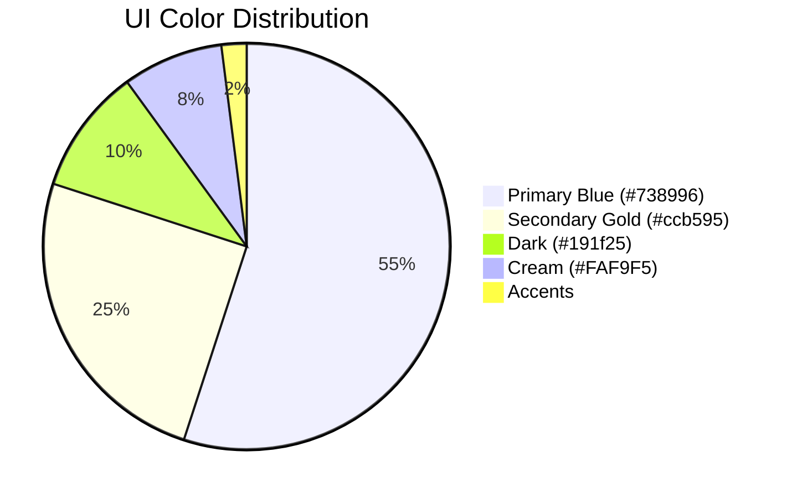
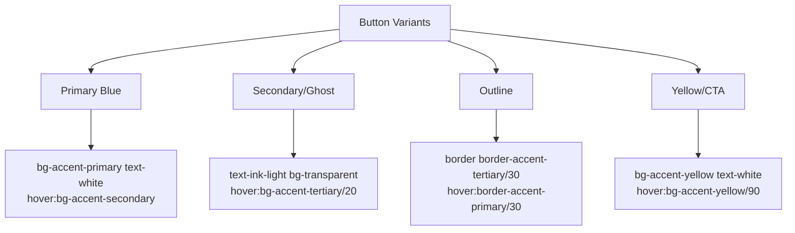
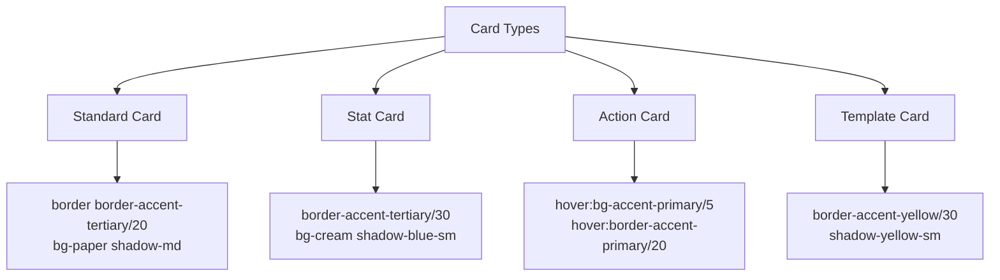
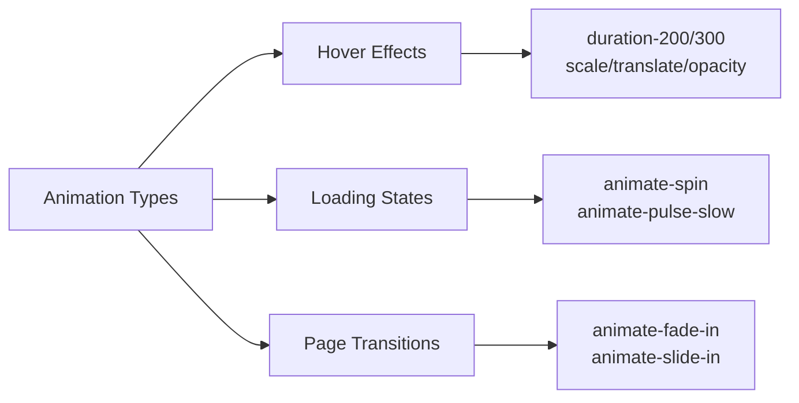

# Autopen UI Style Guide

This document provides comprehensive guidelines for UI design and development in the Autopen application, based on the established patterns in the dashboard and other key components.

## Brand Colors



### Primary Colors

| Color | Hex | Usage |
|-------|-----|-------|
| Primary Blue | `#738996` | Main accent color, buttons, icons, interactive elements |
| Secondary Gold | `#ccb595` | Secondary accent, highlights, progress indicators, awards |
| Dark | `#191f25` | Header, navigation, dropdowns |
| Cream | `#FAF9F5` | Page backgrounds, subtle containers |
| Paper | `#FFFFFF` | Cards, content containers |

### Text Colors

| Color | Hex | Usage |
|-------|-----|-------|
| Ink Dark | `#333333` | Primary text, headings |
| Ink Light | `#666666` | Secondary text, descriptions |
| Ink Faded | `#888888` | Tertiary text, placeholders |
| White | `#FFFFFF` | Text on dark backgrounds |

### Accent Colors

| Color | Hex | Usage |
|-------|-----|-------|
| Primary Blue | `#738996` | Default buttons, highlights, primary actions |
| Secondary Blue | `#5e7282` | Button hover states, secondary actions |
| Tertiary | `#F1F0EC` | Subtle backgrounds, light borders |
| Yellow | `#ccb595` | Call-to-action, important elements |
| Danger | `#DC2626` | Error messages, destructive actions |

## Typography

```css
/* Font Stacks */
--font-sans: "Inter", system-ui, sans-serif;
--font-serif: "Georgia", "Cambria", "Times New Roman", serif;
--font-display: "Georgia", serif;
--font-mono: "Consolas", "Monaco", monospace;
```

### Font Usage

| Element | Font | Size | Weight | Line Height | Example |
|---------|------|------|--------|-------------|---------|
| Page Titles | Georgia | 32px (2rem) | 500 | 1.2 | `class="text-2xl font-display font-medium text-ink-dark tracking-tight"` |
| Card Titles | Georgia | 18px | 500 | 1.3 | `class="font-display text-lg font-medium text-ink-dark"` |
| Section Headers | Georgia | 20px | 500 | 1.3 | `class="text-xl font-display font-medium text-ink-dark tracking-tight"` |
| Body Text | Georgia | 16px | 400 | 1.5 | `class="text-base font-serif text-ink-light"` |
| Small Text | Georgia | 14px | 400 | 1.5 | `class="text-sm font-serif text-ink-light"` |
| Button Text | Georgia | 15px | 500 | 1.4 | `class="text-[15px] font-serif font-medium"` |
| Labels | Inter | 14px | 500 | 1.4 | `class="text-sm font-sans font-medium text-ink-dark"` |

## Spacing

- Base spacing unit: 0.25rem (4px)
- Typical component padding: 1.5rem (24px)
- Grid gap: 1.25rem or 1.75rem (20px or 28px)
- Section spacing: 2rem to 2.5rem (32px to 40px)

## Shadows

| Type | Class | Usage |
|------|-------|-------|
| Soft | `shadow-blue-sm` | Subtle elevation for cards and containers |
| Medium | `shadow-md` | Default shadow for elevated components |
| Hard | `shadow-blue` | Emphasizing important elements |
| Yellow | `shadow-yellow-sm` | Subtle elevation for gold-accented elements |
| Yellow Medium | `shadow-yellow` | Higher emphasis for gold elements |

## Component Styling

### Buttons



#### Primary Button
```html
<Button className="bg-[#738996] text-white hover:bg-[#738996]/90">
  <Sparkles className="w-4 h-4 mr-2" />
  Create Content
</Button>
```

#### Secondary/Ghost Button
```html
<Button 
  variant="ghost" 
  className="text-ink-light hover:bg-accent-tertiary/20"
>
  View Details
</Button>
```

#### Outline Button
```html
<Button 
  variant="outline" 
  className="border-accent-tertiary/30 text-ink-dark hover:border-accent-primary/30"
>
  <Settings className="w-4 h-4 mr-2" />
  Settings
</Button>
```

#### CTA Button (Yellow)
```html
<Button 
  className="bg-[#ccb595] text-white hover:bg-[#ccb595]/90 shadow-yellow-sm"
>
  <Wand2 className="w-4 h-4 mr-2" />
  New AI Content
</Button>
```

### Cards



#### Standard Card
```html
<Card className="border border-[#E8E8E8] bg-white shadow-sm rounded-lg hover:shadow-md transition-all duration-300">
  <CardHeader className="pb-3 pt-5 px-6 border-b border-[#F0F0F0]">
    <div className="flex items-center">
      <Icon className="w-5 h-5 text-[#738996] mr-2" />
      <CardTitle className="text-lg font-medium font-serif text-[#333333]">Card Title</CardTitle>
    </div>
  </CardHeader>
  <CardContent className="px-6 py-5">
    <p className="text-[#666666] text-sm">Card content goes here</p>
  </CardContent>
</Card>
```

#### Stat Card
```html
<Card className="border border-[#E8E8E8] bg-gradient-to-br from-white to-[#F9F7F4] shadow-sm rounded-lg overflow-hidden group hover:border-[#738996] hover:shadow-md transition-all duration-300">
  <CardContent className="p-0">
    <div className="flex flex-col p-5">
      <div className="flex items-center justify-between mb-3">
        <p className="text-[#666666] text-sm font-medium">Stat Title</p>
        <div className="w-10 h-10 bg-[#F5F5F5] rounded-full flex items-center justify-center group-hover:bg-[#738996]/10 transition-colors duration-300">
          <Icon className="w-5 h-5 text-[#738996] group-hover:scale-110 transition-transform duration-300" />
        </div>
      </div>
      <div className="flex items-baseline">
        <p className="text-[#2A2A2A] text-3xl font-serif font-medium">42</p>
        <div className="ml-2 text-xs text-[#738996] font-medium px-1.5 py-0.5 bg-[#738996]/10 rounded">
          Label
        </div>
      </div>
    </div>
    <div className="h-1.5 w-full bg-[#738996]/10">
      <div className="h-1.5 bg-[#738996] w-2/3 rounded-r-full transition-all duration-1000"></div>
    </div>
  </CardContent>
</Card>
```

#### Action Card
```html
<Card 
  className="border border-[#E8E8E8] bg-white hover:border-[#738996]/30 transition-all cursor-pointer shadow-none rounded-lg overflow-hidden group"
  onClick={() => handleAction()}
>
  <CardContent className="p-4 relative overflow-hidden">
    <div className="absolute inset-0 bg-gradient-to-r from-transparent to-[#738996]/5 opacity-0 group-hover:opacity-100 transition-opacity duration-300"></div>
    <div className="flex items-start relative z-10">
      <div className="w-10 h-10 bg-[#F5F5F5] rounded-full flex items-center justify-center mr-3 flex-shrink-0 group-hover:bg-white transition-colors duration-300">
        <Icon className="w-5 h-5 text-[#738996] group-hover:scale-110 transition-transform duration-300" />
      </div>
      <div>
        <h4 className="text-[#2A2A2A] font-medium mb-1">Action Title</h4>
        <p className="text-[#666666] text-sm">Action description goes here</p>
      </div>
    </div>
  </CardContent>
</Card>
```

### Navigation

#### Header
```html
<header className="h-[68px] bg-[#191f25] border-b border-white/10 flex items-center px-8 sticky top-0 z-50 w-full shadow-md">
  <div className="flex items-center">
    <Icon className="w-7 h-7 text-accent-yellow" />
    <span className="font-display text-2xl ml-2.5 text-white tracking-tight">Autopen</span>
  </div>
  <div className="flex-1"></div>
  <div className="flex items-center gap-5">
    <!-- Navigation buttons -->
  </div>
</header>
```

#### Sidebar Navigation
```html
<button
  className={cn(
    "w-full justify-start gap-1.5 text-sm font-serif",
    active
      ? "bg-accent-primary/10 text-ink-dark font-medium"
      : "text-ink-light hover:bg-accent-primary/5 hover:text-ink-dark",
  )}
  onClick={() => navigate(href)}
>
  <div className={active ? "text-accent-primary" : "text-ink-light"}>
    <Icon className="h-5 w-5" />
  </div>
  {label}
</button>
```

## Icons & Illustrations

- Use Lucide icons consistently across the UI
- Icon size in text: 16px (w-4 h-4)
- Icon size in buttons: 16-20px (w-4/5 h-4/5)
- Icon size in headers: 20-24px (w-5/6 h-5/6)
- Icon color should match text color or use accent colors for emphasis

### Icon with Background
```html
<div className="w-10 h-10 bg-[#F5F5F5] rounded-full flex items-center justify-center">
  <Icon className="w-5 h-5 text-[#738996]" />
</div>
```

## Animations & Transitions



### Hover Transitions
- All interactive elements should have `transition-all duration-200` or `duration-300`
- Hover states should subtly change: 
  - Background color (opacity variations)
  - Border color
  - Shadow
  - Scale (subtle 105% or 110%)

### Loading States
```html
<div className="flex items-center justify-center">
  <Loader2 className="w-8 h-8 text-[#738996] animate-spin" />
  <span className="ml-2 text-ink-light">Loading...</span>
</div>
```

## Layout Patterns

### Container Widths
- Content max width: `max-w-7xl`
- Default page padding: `p-8 md:p-10`
- Responsive behavior:
  - Mobile: Single column
  - Tablet: Two columns for some sections
  - Desktop: Full layout with sidebar

### Grid Layouts
```html
<!-- Two-column grid -->
<div className="grid grid-cols-1 lg:grid-cols-2 gap-7">
  <!-- Left column content -->
  <div>...</div>
  
  <!-- Right column content -->
  <div>...</div>
</div>

<!-- Three-column grid -->
<div className="grid grid-cols-1 md:grid-cols-3 gap-5">
  <!-- Column content -->
</div>
```

## Data Visualization

### Progress Bars
```html
<div className="w-full bg-[#E8E8E8] rounded-full h-1.5 mb-1">
  <div 
    className="bg-[#738996] h-1.5 rounded-full transition-all duration-1000" 
    style={{ width: `${progress}%` }}
  ></div>
</div>
```

### Badges & Tags
```html
<Badge className="bg-[#F9F5ED] text-[#ccb595] border-[#ccb595] border font-normal px-2 py-0.5 rounded text-xs">
  Category
</Badge>
```

## Responsive Design Guidelines

- Use Tailwind's responsive prefixes consistently
- Mobile-first approach with layout changes at breakpoints
- Sidebar collapses to hamburger menu below `lg` breakpoint
- Card grids collapse to single column on small screens
- Font sizes remain consistent across breakpoints
- Touch targets should be at least 44px on mobile devices

## Accessibility Guidelines

- Maintain color contrast ratio of at least 4.5:1 for text
- Interactive elements should have hover/focus states
- Use appropriate semantic HTML elements
- Include aria attributes for custom components
- Ensure keyboard navigation works for all interactive elements

## Component Composition Patterns

### Section Headers
```html
<h2 className="text-2xl font-medium text-ink-dark mb-6 flex items-center gap-3 font-display tracking-tight">
  <div className="bg-accent-primary/10 p-1.5 rounded-md">
    <Icon className="w-5 h-5 text-accent-primary" />
  </div>
  Section Title
</h2>
```

### Empty States
```html
<div className="py-10 flex flex-col items-center justify-center">
  <div className="w-16 h-16 bg-[#F5F5F5] rounded-full flex items-center justify-center mb-4">
    <Icon className="w-8 h-8 text-[#CCCCCC]" />
  </div>
  <p className="text-[#666666] text-center">Empty state message</p>
  <Button 
    onClick={() => handleAction()}
    className="mt-4 bg-[#738996] text-white"
  >
    <Plus className="w-4 h-4 mr-2" />
    Call to Action
  </Button>
</div>
```

## Implementation Guidelines

1. Use the Tailwind utility classes directly in components
2. Leverage the shadcn/ui component library for base components
3. Follow the color system defined in the tailwind.config.js
4. Maintain consistent spacing, typography and transitions
5. For custom components, follow the existing patterns
6. Use reactive props to handle different states (hover, active, disabled)
7. Test on multiple screen sizes for responsive behavior

By following these guidelines, you'll ensure a consistent, professional look and feel across the Autopen application, with emphasis on the primary blue (#738996) and secondary gold (#ccb595) accent colors.