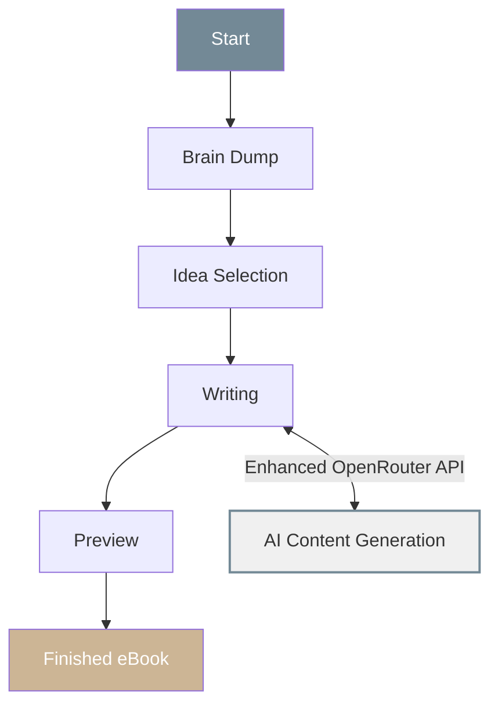

# Creating eBooks with AutopenV3

AutopenV3 makes it easy to create professional eBooks using AI assistance. This guide walks you through the streamlined workflow from initial ideas to a finished, downloadable eBook with our enhanced OpenRouter integration.

## The eBook Creation Workflow

## Step 1: Brain Dump

Start by collecting all your ideas, research, and inspiration.

### Ways to Input Content

- **Text**: Type or paste your thoughts directly
- **Files**: Upload documents (PDF, DOCX, TXT)
- **Links**: Provide web URLs with relevant content
- **YouTube**: Link to informative videos

### Tips for Effective Brain Dumps

- Don't worry about organization - just get your ideas down
- Include keywords related to your topic
- Add questions you want your eBook to answer
- Include references to resources you've found helpful
- Mention your target audience and their needs

### What Happens Next

After submitting your brain dump, our AI analyzes your content and identifies potential eBook concepts, structures, and focus areas.

## Step 2: Idea Selection

Review AI-generated ideas based on your brain dump.

### Selection Process

- Browse through generated concepts
- Select the idea that best matches your vision
- Refine the concept with additional details
- Define your target audience more specifically

### Idea Customization

- Edit the title and description
- Adjust the focus and scope
- Add specific points you want to cover
- Remove elements that don't fit your vision

## Step 3: eBook Writing

Watch as AutopenV3 generates high-quality content for your entire eBook with our enhanced OpenRouter integration.

### Streamlined Generation Process

- Content is created chapter by chapter with intelligent context awareness
- View progress in real-time with streaming content updates
- Generate individual chapters or trigger automatic generation of all content
- AI maintains consistent tone and style throughout the document
- Enhanced reliability with improved OpenRouter integration

### Writing Controls

- Generate each chapter individually for more control
- Use the "Auto-Generate All Chapters" feature for faster completion
- See real-time progress indicators as content is created
- Expanded content flexibility with larger token context windows

### Customization Options

- Expand any chapter to view its content as it's being generated
- Request regeneration of specific chapters if needed
- Chapters build on previous content for greater continuity
- Each chapter intelligently incorporates your brain dump content

## Step 4: Preview & Export

Review your complete eBook and prepare it for distribution with our enhanced preview and export functionality.

### Preview Features

- Complete document review with expandable chapters
- Improved formatting with proper markdown-to-HTML conversion
- Dynamic table of contents generation
- Content navigation with collapsible sections
- Real-time word count calculation

### Export Options

- Professional PDF format with enhanced styling
- Direct download capability
- Table of contents with proper linking
- Document metadata embedding
- Consistent font and layout formatting

## Best Practices for Quality eBooks

### Planning Your Content

- **Define your purpose**: Why are you creating this eBook?
- **Know your audience**: Who will read it and what do they need?
- **Set clear objectives**: What should readers learn or gain?
- **Gather resources**: Collect research, examples, and references

### Brain Dump Strategies

- **Time-block**: Set aside 30-60 minutes of uninterrupted time
- **Use categories**: Organize thoughts by main topic areas
- **Include examples**: Real-world examples strengthen your content
- **Add personal insights**: Your unique perspective adds value

### Working with AI-Generated Content

- **Review carefully**: AI content may need human refinement
- **Add personal voice**: Insert your unique perspective
- **Verify facts**: Double-check statistics and claims
- **Enhance with examples**: Add personal anecdotes and case studies

### Finalizing Your eBook

- **Proofread thoroughly**: Check for errors and inconsistencies
- **Test on different devices**: Ensure readability across platforms
- **Gather feedback**: Have others review before publishing
- **Create a compelling cover**: First impressions matter

## Examples of Successful eBooks

### Case Study: "Digital Marketing Fundamentals"

**Starting point**: A brain dump about social media strategies, SEO, and content marketing
**Final product**: A comprehensive 65-page guide targeting small business owners
**Result**: Over 1,200 downloads in the first month

### Case Study: "Beginner's Guide to Sustainable Living"

**Starting point**: Personal notes on reducing waste and eco-friendly practices
**Final product**: A practical 45-page handbook with actionable tips
**Result**: Featured in environmental newsletters and used by community groups

## Troubleshooting

### Common Issues and Solutions

| Issue | Solution |
|-------|----------|
| Content seems generic | Add more specific examples in your brain dump |
| Generated text is too technical | Specify a simpler reading level in settings |
| Topics are not well-connected | Add transition notes between chapters |
| Content is too short | Increase the detail level in chapter descriptions |
| Too much content | Specify word count limits in chapter settings |

### Getting Help

If you encounter issues during the eBook creation process:

- Check the FAQ section in Settings
- Review tooltips for specific features
- Contact support through the Help button
- Visit our knowledge base for detailed guides

## Next Steps After Creating Your eBook

- Add to a project for organization
- Share with collaborators for feedback
- Create a blog series based on chapters
- Develop a course expanding on the eBook content
- Analyze performance with our insights tool

---

Ready to create your first eBook? Click "New Content" on your dashboard and select "eBook" from the workflow options.