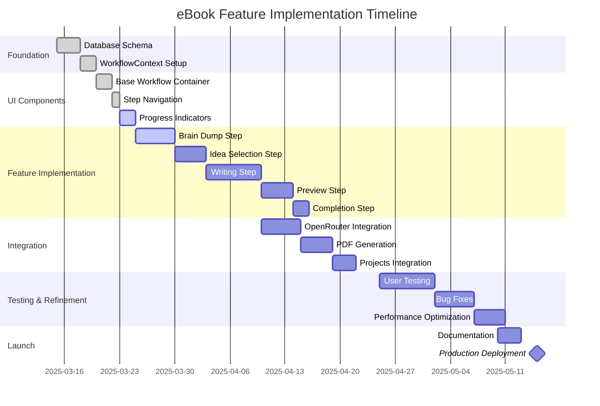

# eBook Creation: Implementation Plan

This document outlines the implementation plan for the eBook creation feature in AutopenV3, providing a structured approach to building this functionality.

## Project Timeline



## Implementation Phases

### Phase 1: Foundation (Completed)
- ✅ Database schema design for brain dumps, ebook workflow, and content storage
- ✅ WorkflowContext implementation with React Context API
- ✅ Base UI components using shadcn/ui

### Phase 2: Core Workflow (In Progress)
- ✅ Workflow container with step navigation
- ✅ Progress tracking and persistence
- 🔄 Brain dump input and analysis integration
- ⬜ Idea generation and selection interface
- ⬜ Chapter structure definition and management

### Phase 3: Content Generation
- ⬜ OpenRouter API integration for content generation
- ⬜ Content streaming and progressive updates
- ⬜ Content editing capabilities
- ⬜ Introduction and conclusion generation

### Phase 4: Export & Integration
- ⬜ PDF generation and formatting
- ⬜ Project organization integration
- ⬜ Content versioning
- ⬜ Export options (PDF, Markdown, HTML)

### Phase 5: Testing & Refinement
- ⬜ User testing and feedback collection
- ⬜ Performance optimization for large documents
- ⬜ Error handling improvements
- ⬜ UI/UX refinements

## Task Breakdown

### Brain Dump Step

1. Input interface with tabs for different input types:
   - Text area for direct input
   - File upload for documents
   - URL input for web content
   - YouTube link processing

2. Content processing and analysis:
   - Text extraction from various formats
   - Content chunking for large inputs
   - AI analysis using OpenRouter

3. Status tracking and error handling:
   - Progress indicators for long-running processes
   - Error recovery mechanisms
   - Persistence of partial results

### Idea Selection Step

1. Present AI-generated ideas:
   - Card interface for each concept
   - Selection and ranking capabilities
   - Filtering and sorting options

2. Idea refinement:
   - Edit and customize generated ideas
   - Combine multiple concepts
   - Add user-defined elements

3. Selection confirmation:
   - Preview of selected concept
   - Additional context input
   - Target audience definition

### eBook Writing Step

1. Chapter structure management:
   - Add/remove/reorder chapters
   - Define chapter titles and descriptions
   - Set content focus for each section

2. Content generation:
   - Progressive generation for each chapter
   - Status indicators and progress tracking
   - Pause/resume capabilities for long documents

3. Content editing:
   - In-place editing of generated content
   - Formatting tools using Markdown
   - Save and version tracking

### Preview & Export Step

1. Complete eBook preview:
   - Full document rendering with styling
   - Table of contents generation
   - Cover page customization

2. Export options:
   - PDF generation with custom formatting
   - Markdown export for further editing
   - HTML version for web publication

3. Final adjustments:
   - Global formatting controls
   - Metadata editing (author, publication date, etc.)
   - Finalization process

## Technical Requirements

### Frontend Components
- React functional components with TypeScript
- Tailwind CSS with shadcn/ui components
- State management via Context API
- Form handling with react-hook-form

### Backend (Supabase)
- PostgreSQL tables with proper relationships
- Row Level Security (RLS) policies
- Storage buckets for file uploads
- Supabase Auth integration

### AI Integration
- OpenRouter API for content generation
- Proper token management and optimization
- Prompt engineering for quality output
- Error handling and retry mechanisms

### PDF Generation
- Client-side PDF generation using jsPDF
- Custom styling and formatting options
- Image and formatting support
- Downloadable file generation

## Dependencies

- **shadcn/ui**: UI component library
- **react-hook-form**: Form state management
- **zod**: Form validation
- **jsPDF**: PDF generation
- **marked**: Markdown processing
- **@supabase/supabase-js**: Database interaction

## Implementation Approach

### Using Feature Flags
We'll use feature flags to gradually roll out functionality:

```typescript
const featureFlags = {
  brainDumpAnalysis: true,
  advancedIdeaSelection: false,
  streamingContentGeneration: false,
  enhancedPdfExport: false
};

// Usage example
{featureFlags.advancedIdeaSelection && (
  <AdvancedSelectionControls />
)}
```

### Progressive Enhancement
Implement core functionality first with planned enhancements:

1. Basic Version:
   - Text-only brain dump
   - Simple chapter structure
   - Basic PDF export

2. Enhanced Version:
   - Multiple input types
   - Advanced chapter organization
   - Styled PDF with customization

3. Premium Version:
   - Custom branding
   - Advanced export options
   - Integration with publishing platforms

## API Design

### Brain Dump Analysis
```typescript
async function analyzeBrainDump(content: string): Promise<BrainDumpAnalysis> {
  // Implementation
}

interface BrainDumpAnalysis {
  mainTopics: string[];
  suggestedIdeas: IdeaConcept[];
  keyInsights: string[];
  targetAudience: string[];
}
```

### Content Generation
```typescript
async function generateChapterContent(
  chapterInfo: ChapterInfo, 
  contextData: ContextData
): Promise<string> {
  // Implementation
}

interface ChapterInfo {
  title: string;
  description: string;
  keyPoints: string[];
  wordCount: number;
}

interface ContextData {
  bookTitle: string;
  bookDescription: string;
  targetAudience: string;
  previousChapters: string[];
}
```

## Testing Plan

1. **Unit Tests**:
   - Component rendering tests
   - State management logic
   - Form validation

2. **Integration Tests**:
   - Workflow progression
   - API interactions
   - Database operations

3. **End-to-End Tests**:
   - Complete workflow scenarios
   - Export functionality
   - Error conditions

4. **User Acceptance Testing**:
   - Invite beta testers
   - Collect structured feedback
   - Measure completion rates

## Documentation Requirements

1. **User Documentation**:
   - Step-by-step guide with screenshots
   - Tips for optimal content generation
   - Troubleshooting common issues

2. **Developer Documentation**:
   - API references
   - Component documentation
   - State management patterns

3. **Architecture Documentation**:
   - System design diagrams
   - Data flow descriptions
   - Integration points

## Risk Assessment

| Risk | Impact | Probability | Mitigation |
|------|--------|-------------|------------|
| API rate limits | High | Medium | Implement queuing and caching |
| Content quality issues | High | Medium | Add review steps and editing capabilities |
| Performance with large documents | Medium | High | Implement chunking and progressive loading |
| Browser compatibility | Medium | Low | Comprehensive testing across browsers |
| Data loss | High | Low | Auto-saving and persistent storage |

## Success Metrics

- **User Completion Rate**: >80% of started workflows completed
- **Generation Quality**: >85% user satisfaction with generated content
- **Performance**: <3 second response time for primary interactions
- **Scalability**: Support documents up to 50,000 words
- **Error Rate**: <2% failure rate for end-to-end workflow

## Next Steps

1. Complete the Brain Dump step implementation
2. Begin work on the Idea Selection interface
3. Set up OpenRouter API integration for content generation
4. Implement basic PDF export functionality
5. Conduct initial user testing with prototype