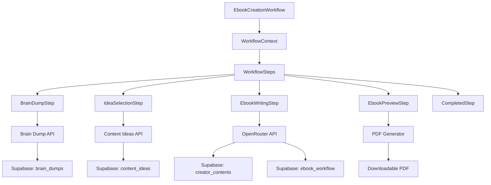
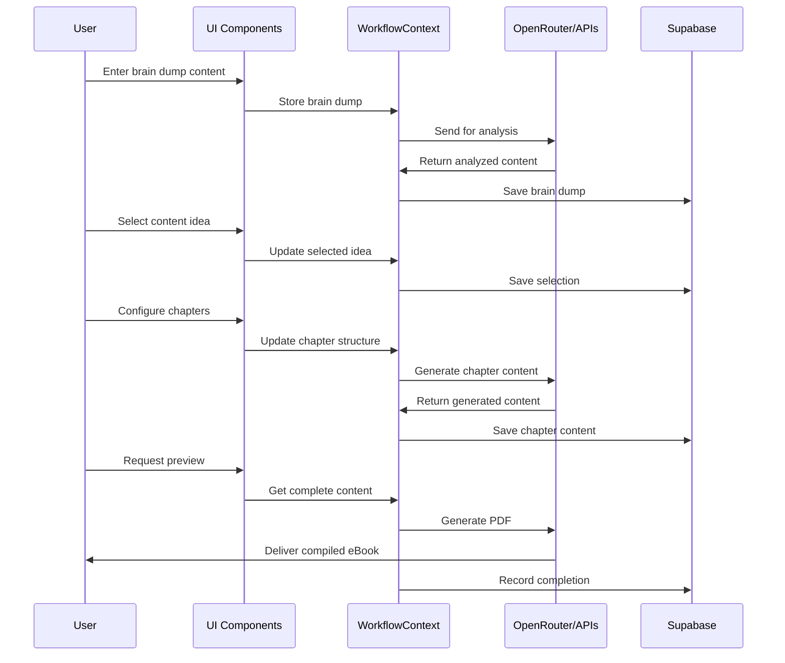

# eBook Creation: Technical Implementation Guide

This document provides a comprehensive technical guide for the eBook creation workflow in AutopenV3, explaining the components, data flow, and integration points.

## Architecture Overview



## Component Structure

The eBook workflow consists of several key components:

### 1. Workflow Container
`/src/components/workflow/WorkflowContainer.tsx`
- Wrapper component that manages the workflow state
- Handles navigation between steps
- Provides context to all child components

### 2. Workflow Context
`/src/lib/contexts/WorkflowContext.tsx`
- Central state management for the entire workflow
- Stores data from each step
- Handles persistent state across page reloads

### 3. Individual Step Components
Each step in the workflow is implemented as a separate component:

#### BrainDumpStep
`/src/components/workflow/steps/BrainDumpStep.tsx`
- Collects initial content and ideas from the user
- Supports text, file upload, link input, and YouTube content
- Processes input through AI analysis

#### IdeaSelectionStep
`/src/components/workflow/steps/IdeaSelectionStep.tsx`
- Presents AI-generated content ideas based on brain dump
- Allows selection and refinement of concepts
- Sets direction for the eBook creation

#### EbookWritingStep
`/src/components/workflow/steps/EbookWritingStep.tsx`
- Manages chapter structure and content generation
- Interfaces with OpenRouter API for content creation
- Handles progressive content generation with status updates

#### EbookPreviewStep
`/src/components/workflow/steps/EbookPreviewStep.tsx`
- Displays final eBook content for review
- Provides PDF generation functionality
- Allows final edits before completion

#### CompletedStep
`/src/components/workflow/steps/CompletedStep.tsx`
- Confirmation screen with download options
- Links to projects for organization
- Offers next steps to the user

## Data Flow



## Database Schema

The eBook workflow utilizes several tables in the Supabase database:

### brain_dumps
Stores the initial user input and analysis.
```sql
CREATE TABLE brain_dumps (
    id UUID PRIMARY KEY DEFAULT uuid_generate_v4(),
    user_id UUID REFERENCES auth.users(id) ON DELETE CASCADE,
    content TEXT NOT NULL,
    title VARCHAR,
    created_at TIMESTAMPTZ DEFAULT NOW(),
    status VARCHAR DEFAULT 'pending',
    analysis JSONB
);
```

### ebook_workflow
Tracks the eBook creation process.
```sql
CREATE TABLE ebook_workflow (
    id UUID PRIMARY KEY DEFAULT uuid_generate_v4(),
    user_id UUID REFERENCES auth.users(id) ON DELETE CASCADE,
    brain_dump_id UUID REFERENCES brain_dumps(id),
    title VARCHAR NOT NULL,
    description TEXT,
    chapters JSONB,
    status VARCHAR DEFAULT 'in_progress',
    created_at TIMESTAMPTZ DEFAULT NOW(),
    updated_at TIMESTAMPTZ DEFAULT NOW()
);
```

### creator_contents
Stores the actual eBook content.
```sql
CREATE TABLE creator_contents (
    id UUID PRIMARY KEY DEFAULT uuid_generate_v4(),
    user_id UUID REFERENCES auth.users(id) ON DELETE CASCADE,
    content_type VARCHAR NOT NULL,
    title VARCHAR NOT NULL,
    content TEXT,
    metadata JSONB,
    created_at TIMESTAMPTZ DEFAULT NOW(),
    updated_at TIMESTAMPTZ DEFAULT NOW()
);
```

## API Integration

### OpenRouter API
The workflow uses OpenRouter for content generation:

```typescript
// Example implementation from /src/lib/openRouter.ts
export async function generateEbookContent(
  chapter: ChapterStructure, 
  context: string
): Promise<string> {
  const prompt = `Write a comprehensive chapter for an eBook with the following details:
    Title: ${chapter.title}
    Description: ${chapter.description}
    Context: ${context}
    
    The chapter should be well-structured, informative, and engaging.
    Use markdown formatting for headings, lists, and emphasis.`;
    
  const response = await fetch('https://openrouter.ai/api/v1/chat/completions', {
    method: 'POST',
    headers: {
      'Content-Type': 'application/json',
      'Authorization': `Bearer ${import.meta.env.VITE_OPENROUTER_API_KEY}`
    },
    body: JSON.stringify({
      model: 'anthropic/claude-3-opus-20240229',
      messages: [{ role: 'user', content: prompt }],
      max_tokens: 4000
    })
  });
  
  const data = await response.json();
  return data.choices[0].message.content;
}
```

### PDF Generation
PDF generation is handled using the pdfGenerator utility:

```typescript
// Example from /src/lib/pdfGenerator.ts
export async function generateEbookPDF(
  title: string,
  author: string,
  chapters: Chapter[]
): Promise<Blob> {
  const doc = new jsPDF();
  
  // Add title page
  doc.setFontSize(24);
  doc.text(title, 105, 80, { align: 'center' });
  
  doc.setFontSize(16);
  doc.text(`By ${author}`, 105, 100, { align: 'center' });
  
  // Add each chapter
  let currentPage = 2;
  chapters.forEach(chapter => {
    doc.addPage();
    doc.setFontSize(18);
    doc.text(chapter.title, 20, 20);
    
    doc.setFontSize(12);
    const splitText = doc.splitTextToSize(chapter.content, 170);
    doc.text(splitText, 20, 40);
    
    currentPage += Math.ceil(splitText.length / 47) + 1;
  });
  
  return doc.output('blob');
}
```

## State Management

The WorkflowContext manages state for the entire eBook creation process:

```typescript
// Example from /src/lib/contexts/WorkflowContext.tsx
interface WorkflowState {
  currentStep: number;
  brainDump: {
    content: string;
    analysis: any;
  };
  selectedIdea: {
    title: string;
    description: string;
  };
  ebookStructure: {
    title: string;
    chapters: Chapter[];
  };
  generatedContent: {
    introduction: string;
    chapters: { [key: string]: string };
    conclusion: string;
  };
}

const WorkflowContext = createContext<{
  state: WorkflowState;
  dispatch: React.Dispatch<WorkflowAction>;
}>(null!);

// Reducer pattern for state updates
function workflowReducer(state: WorkflowState, action: WorkflowAction): WorkflowState {
  switch (action.type) {
    case 'SET_BRAIN_DUMP':
      return { ...state, brainDump: action.payload };
    case 'SET_SELECTED_IDEA':
      return { ...state, selectedIdea: action.payload };
    case 'SET_EBOOK_STRUCTURE':
      return { ...state, ebookStructure: action.payload };
    case 'ADD_GENERATED_CONTENT':
      return { 
        ...state, 
        generatedContent: {
          ...state.generatedContent,
          chapters: {
            ...state.generatedContent.chapters,
            [action.payload.id]: action.payload.content
          }
        }
      };
    // Other cases...
    default:
      return state;
  }
}
```

## Error Handling

The workflow implements comprehensive error handling:

```typescript
// Example error handling pattern
try {
  const result = await generateChapterContent(chapter);
  dispatch({ type: 'ADD_GENERATED_CONTENT', payload: { id: chapter.id, content: result } });
} catch (error) {
  // Log error
  console.error('Error generating chapter content:', error);
  
  // Set error state
  setError(`Failed to generate content for chapter "${chapter.title}". Please try again.`);
  
  // Retry logic
  if (retryCount < 3) {
    setRetryCount(prev => prev + 1);
    setTimeout(() => generateContent(), 2000 * retryCount);
  }
}
```

## Persistence

The workflow state is persisted to maintain progress across sessions:

```typescript
// Save state to localStorage on changes
useEffect(() => {
  if (state.currentStep > 0) {
    localStorage.setItem('ebook_workflow_state', JSON.stringify(state));
  }
}, [state]);

// Initialize state from localStorage or defaults
const initialState = () => {
  const saved = localStorage.getItem('ebook_workflow_state');
  if (saved) {
    try {
      return JSON.parse(saved);
    } catch (e) {
      console.error('Failed to parse saved workflow state:', e);
    }
  }
  return defaultWorkflowState;
};
```

## Implementation Guidelines

When working with the eBook workflow, follow these guidelines:

1. **State Management**: Always use the WorkflowContext for state changes
2. **API Handling**: Implement proper error handling and retries for all API calls
3. **Progress Tracking**: Update the workflow status in the database at each step
4. **User Experience**: Provide loading states and progress indicators for long operations
5. **Data Validation**: Validate user input and AI-generated content at each step
6. **Performance**: Use streaming responses when possible for large content generation
7. **Security**: Verify user permissions through Supabase RLS for all database operations

## Testing

Test each step of the workflow individually:

1. **Brain Dump**: Verify content is stored and analyzed correctly
2. **Idea Selection**: Confirm selections are saved properly
3. **Content Generation**: Test API integration with various inputs
4. **Preview/Export**: Validate PDF generation with different content types

## Extending the Workflow

To add new capabilities to the eBook workflow:

1. Add new state fields to the WorkflowContext
2. Create new components or enhance existing ones
3. Update database schemas if necessary
4. Extend API integrations for new functionality
5. Update UI to expose new features to users