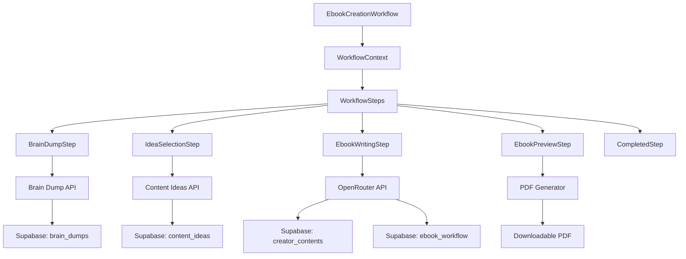
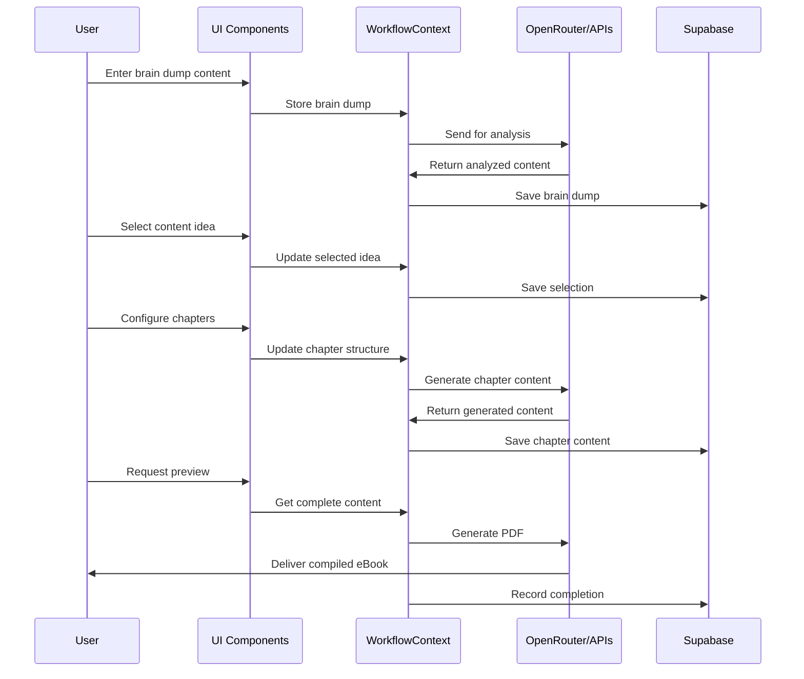

# eBook Creation: Technical Implementation Guide

This document provides a comprehensive technical guide for the eBook creation workflow in AutopenV3, explaining the components, data flow, and integration points.

## Architecture Overview



## Component Structure

The eBook workflow consists of several key components:

### 1. Workflow Container
`/src/components/workflow/WorkflowContainer.tsx`
- Wrapper component that manages the workflow state
- Handles navigation between steps
- Provides context to all child components

### 2. Workflow Context
`/src/lib/contexts/WorkflowContext.tsx`
- Central state management for the entire workflow
- Stores data from each step
- Handles persistent state across page reloads

### 3. Individual Step Components
Each step in the workflow is implemented as a separate component:

#### BrainDumpStep
`/src/components/workflow/steps/BrainDumpStep.tsx`
- Collects initial content and ideas from the user
- Supports text, file upload, link input, and YouTube content
- Processes input through AI analysis

#### IdeaSelectionStep
`/src/components/workflow/steps/IdeaSelectionStep.tsx`
- Presents AI-generated content ideas based on brain dump
- Allows selection and refinement of concepts
- Sets direction for the eBook creation

#### EbookWritingStep
`/src/components/workflow/steps/EbookWritingStep.tsx`
- Manages chapter structure and content generation
- Interfaces with OpenRouter API for content creation
- Handles progressive content generation with status updates

#### EbookPreviewStep
`/src/components/workflow/steps/EbookPreviewStep.tsx`
- Displays final eBook content for review
- Provides PDF generation functionality
- Allows final edits before completion

#### CompletedStep
`/src/components/workflow/steps/CompletedStep.tsx`
- Confirmation screen with download options
- Links to projects for organization
- Offers next steps to the user

## Data Flow



## Database Schema

The eBook workflow utilizes several tables in the Supabase database:

### brain_dumps
Stores the initial user input and analysis.
```sql
CREATE TABLE brain_dumps (
    id UUID PRIMARY KEY DEFAULT uuid_generate_v4(),
    user_id UUID REFERENCES auth.users(id) ON DELETE CASCADE,
    content TEXT NOT NULL,
    title VARCHAR,
    created_at TIMESTAMPTZ DEFAULT NOW(),
    status VARCHAR DEFAULT 'pending',
    analysis JSONB
);
```

### ebook_workflow
Tracks the eBook creation process.
```sql
CREATE TABLE ebook_workflow (
    id UUID PRIMARY KEY DEFAULT uuid_generate_v4(),
    user_id UUID REFERENCES auth.users(id) ON DELETE CASCADE,
    brain_dump_id UUID REFERENCES brain_dumps(id),
    title VARCHAR NOT NULL,
    description TEXT,
    chapters JSONB,
    status VARCHAR DEFAULT 'in_progress',
    created_at TIMESTAMPTZ DEFAULT NOW(),
    updated_at TIMESTAMPTZ DEFAULT NOW()
);
```

### creator_contents
Stores the actual eBook content.
```sql
CREATE TABLE creator_contents (
    id UUID PRIMARY KEY DEFAULT uuid_generate_v4(),
    user_id UUID REFERENCES auth.users(id) ON DELETE CASCADE,
    content_type VARCHAR NOT NULL,
    title VARCHAR NOT NULL,
    content TEXT,
    metadata JSONB,
    created_at TIMESTAMPTZ DEFAULT NOW(),
    updated_at TIMESTAMPTZ DEFAULT NOW()
);
```

## API Integration

### Enhanced OpenRouter API
The workflow uses an improved OpenRouter integration for content generation:

```typescript
// Enhanced implementation from /src/lib/openRouter.ts
export async function generateChapterContent(
  bookTitle: string,
  bookDescription: string,
  chapterTitle: string, 
  chapterDescription: string,
  chapterIndex: number,
  totalChapters: number,
  brainDumpContent: string,
  previousChapters: { title: string; content?: string }[]
): Promise<string> {
  // Determine chapter type for specialized prompting
  const isIntroduction = chapterIndex === 0;
  const isConclusion = chapterIndex === totalChapters - 1;
  
  let chapterType = "main chapter";
  if (isIntroduction) chapterType = "introduction";
  if (isConclusion) chapterType = "conclusion";

  // Dynamic system prompt based on chapter type
  const systemPrompt = `You are an award-winning professional author with expertise in the subject matter.
Write a ${chapterType} for an eBook titled "${bookTitle}" with the quality and depth expected from a bestselling author.
Your writing should be engaging, informative, and substantial. Use clear language, relevant examples, and insightful analysis.
Each chapter should be approximately 2,500-3,000 words in length to ensure the complete book reaches 30,000+ words total.`;

  // Build context from previous chapters for continuity
  let previousChapterContexts = '';
  if (previousChapters?.length > 0) {
    const validPreviousChapters = previousChapters.filter(ch => ch && ch.title && ch.content);
    
    if (validPreviousChapters.length > 0) {
      previousChapterContexts = validPreviousChapters
        .map((ch, idx) => {
          const content = ch.content || "";
          // Extract first paragraph and any headings for a summary
          const firstParagraph = content.split('\n\n')[0] || "";
          const headings = content.match(/##\s.+/g) || [];
          return `Chapter ${idx + 1}: "${ch.title}"\n${firstParagraph}\nKey sections: ${headings.join(', ')}`;
        })
        .join('\n\n');
    }
  }

  // Comprehensive prompt with specific chapter guidance
  const prompt = `
WRITE ${chapterType.toUpperCase()} FOR EBOOK: "${bookTitle}"

BOOK DESCRIPTION: "${bookDescription}"

CHAPTER TITLE: "${chapterTitle}"
CHAPTER DESCRIPTION: "${chapterDescription || ''}"
CHAPTER NUMBER: ${chapterIndex + 1} of ${totalChapters}

${previousChapterContexts ? `PREVIOUS CHAPTERS SUMMARY:\n${previousChapterContexts}\n\n` : ''}

BRAIN DUMP CONTENT (USE AS REFERENCE MATERIAL):
${brainDumpContent.substring(0, 8000)}

${isIntroduction ? 
  `For the introduction:
  - Start with a compelling hook that grabs the reader's attention
  - Clearly state the purpose and value of the book
  - Provide context for why this topic matters now
  - Outline what readers will learn and how it will benefit them
  - Briefly summarize the key themes or concepts that will be covered
  - End with a roadmap of what's to come in the following chapters` : 
  isConclusion ? 
  `For the conclusion:
  - Summarize the key points covered throughout the book
  - Synthesize the main lessons and insights
  - Connect back to the introduction's promises and show how they've been fulfilled
  - Provide final thoughts, recommendations, and forward-looking perspectives
  - Include practical next steps or a call to action for the reader
  - End on an inspiring note that leaves the reader satisfied and motivated` : 
  `For this main chapter:
  - Begin with an engaging introduction to the chapter's specific topic
  - Divide the content into 4-6 distinct sections with clear subheadings
  - Include practical examples, case studies, or stories to illustrate key points
  - Provide actionable insights, frameworks, or step-by-step guidance where appropriate
  - Include expert perspectives and evidence-based information
  - Anticipate and address common questions or challenges related to the topic
  - End with a summary of key takeaways and a smooth transition to the next chapter`}

Important guidelines:
- Write approximately 2,500-3,000 words of substantial content
- Use markdown formatting (## for main headings, ### for subheadings)
- Include bullet points, numbered lists, and other formatting to enhance readability
- Maintain consistent tone and style with previous chapters (if any)
- Ensure the content flows logically and builds on previous information
- Write with authority and expertise on the subject matter

Make this chapter substantial and valuable. It should stand on its own while contributing to the complete narrative of the book.`;

  // Call OpenRouter with enhanced error handling and timeout control
  try {
    const response = await fetchWithTimeout(OPENROUTER_API_URL, {
      method: 'POST',
      headers: {
        'Content-Type': 'application/json',
        'Authorization': `Bearer ${OPENROUTER_KEY}`,
        'HTTP-Referer': window.location.origin,
        'X-Title': 'AutoPen App',
        'Origin': window.location.origin
      },
      body: JSON.stringify({
        model: OPENROUTER_MODEL,
        messages: [
          { role: 'system', content: systemPrompt },
          { role: 'user', content: prompt }
        ],
        temperature: 1.0
      })
    }, 20000); // 20-second timeout
    
    const data = await response.json();
    return data.choices[0].message.content;
  } catch (error) {
    logError('generateChapterContent', error);
    throw new Error(`Failed to generate chapter content: ${error.message}`);
  }
}
```

### PDF Generation
PDF generation is handled using the pdfGenerator utility:

```typescript
// Example from /src/lib/pdfGenerator.ts
export async function generateEbookPDF(
  title: string,
  author: string,
  chapters: Chapter[]
): Promise<Blob> {
  const doc = new jsPDF();
  
  // Add title page
  doc.setFontSize(24);
  doc.text(title, 105, 80, { align: 'center' });
  
  doc.setFontSize(16);
  doc.text(`By ${author}`, 105, 100, { align: 'center' });
  
  // Add each chapter
  let currentPage = 2;
  chapters.forEach(chapter => {
    doc.addPage();
    doc.setFontSize(18);
    doc.text(chapter.title, 20, 20);
    
    doc.setFontSize(12);
    const splitText = doc.splitTextToSize(chapter.content, 170);
    doc.text(splitText, 20, 40);
    
    currentPage += Math.ceil(splitText.length / 47) + 1;
  });
  
  return doc.output('blob');
}
```

## State Management

The WorkflowContext manages state for the entire eBook creation process:

```typescript
// Example from /src/lib/contexts/WorkflowContext.tsx
interface WorkflowState {
  currentStep: number;
  brainDump: {
    content: string;
    analysis: any;
  };
  selectedIdea: {
    title: string;
    description: string;
  };
  ebookStructure: {
    title: string;
    chapters: Chapter[];
  };
  generatedContent: {
    introduction: string;
    chapters: { [key: string]: string };
    conclusion: string;
  };
}

const WorkflowContext = createContext<{
  state: WorkflowState;
  dispatch: React.Dispatch<WorkflowAction>;
}>(null!);

// Reducer pattern for state updates
function workflowReducer(state: WorkflowState, action: WorkflowAction): WorkflowState {
  switch (action.type) {
    case 'SET_BRAIN_DUMP':
      return { ...state, brainDump: action.payload };
    case 'SET_SELECTED_IDEA':
      return { ...state, selectedIdea: action.payload };
    case 'SET_EBOOK_STRUCTURE':
      return { ...state, ebookStructure: action.payload };
    case 'ADD_GENERATED_CONTENT':
      return { 
        ...state, 
        generatedContent: {
          ...state.generatedContent,
          chapters: {
            ...state.generatedContent.chapters,
            [action.payload.id]: action.payload.content
          }
        }
      };
    // Other cases...
    default:
      return state;
  }
}
```

## Error Handling

The workflow implements enhanced error handling with improved OpenRouter API integration:

```typescript
// Enhanced error handling pattern with fetchWithTimeout
const fetchWithTimeout = async (url: string, options: RequestInit, timeout: number) => {
  const controller = new AbortController();
  const { signal } = controller;
  
  // Create a timeout that will abort the fetch
  const timeoutId = setTimeout(() => {
    controller.abort();
  }, timeout);
  
  try {
    console.log(`DEBUG: Sending request to ${url} with options:`, {
      method: options.method,
      headers: options.headers,
      bodyLength: options.body ? JSON.stringify(options.body).length : 0
    });
    
    // Combine the provided signal (if any) with our timeout signal
    const mergedOptions = {
      ...options,
      signal,
      mode: 'cors' as RequestMode // Explicitly set CORS mode
    };
    
    const response = await fetch(url, mergedOptions);
    clearTimeout(timeoutId);
    console.log(`DEBUG: Received response with status: ${response.status}`);
    return response;
  } catch (error: any) {
    clearTimeout(timeoutId);
    
    console.error(`DEBUG: Fetch error:`, error);
    
    // Enhanced error handling for timeouts
    if (error.name === 'AbortError') {
      throw new Error(`API request timed out after ${timeout/1000} seconds. The server did not respond in time.`);
    }
    
    throw error;
  }
};

// Workflow component error handling
try {
  // Show a user-friendly status during generation
  setGeneratingChapter(chapter.id);
  
  // Auto-expand the chapter being generated for better UX
  setExpandedChapter(chapter.id);
  
  // Scroll to the chapter element to keep it in view
  const chapterElement = document.getElementById(`chapter-${chapter.id}`);
  if (chapterElement) {
    chapterElement.scrollIntoView({ behavior: 'smooth', block: 'center' });
  }
  
  // Call the content generation function with enhanced error handling
  await generateEbookChapter(chapter.id);
  
  // Check if we should auto-advance to preview step
  const allGenerated = ebookChapters.every(c => 
    (c.id === chapter.id) ? true : c.status === 'generated'
  );
  
  if (allGenerated) {
    // Provide a small delay to allow UI updates to complete
    setTimeout(() => {
      setCurrentStep('ebook-preview');
    }, 500);
  }
} catch (err: any) {
  // Create user-friendly error messages based on error type
  let errorMessage = 'Failed to generate chapter';
  
  if (err.message?.includes('timed out')) {
    errorMessage = 'The API request timed out. Please try again.';
  } else if (err.message?.includes('rate limit')) {
    errorMessage = 'API rate limit reached. Please try again in a few minutes.';
  } else if (err.message?.includes('token')) {
    errorMessage = 'Content is too large. The system will try with a smaller chunk.';
  }
  
  setError(errorMessage);
  setGeneratingChapter(null);
}
```

## Persistence

The workflow state is persisted to maintain progress across sessions:

```typescript
// Save state to localStorage on changes
useEffect(() => {
  if (state.currentStep > 0) {
    localStorage.setItem('ebook_workflow_state', JSON.stringify(state));
  }
}, [state]);

// Initialize state from localStorage or defaults
const initialState = () => {
  const saved = localStorage.getItem('ebook_workflow_state');
  if (saved) {
    try {
      return JSON.parse(saved);
    } catch (e) {
      console.error('Failed to parse saved workflow state:', e);
    }
  }
  return defaultWorkflowState;
};
```

## Implementation Guidelines

When working with the eBook workflow, follow these guidelines:

1. **State Management**: Always use the WorkflowContext for state changes
2. **API Handling**: Implement proper error handling and retries for all API calls
3. **Progress Tracking**: Update the workflow status in the database at each step
4. **User Experience**: Provide loading states and progress indicators for long operations
5. **Data Validation**: Validate user input and AI-generated content at each step
6. **Performance**: Use streaming responses when possible for large content generation
7. **Security**: Verify user permissions through Supabase RLS for all database operations

## Testing

Test each step of the workflow individually:

1. **Brain Dump**: Verify content is stored and analyzed correctly
2. **Idea Selection**: Confirm selections are saved properly
3. **Content Generation**: Test API integration with various inputs
4. **Preview/Export**: Validate PDF generation with different content types

## Extending the Workflow

To add new capabilities to the eBook workflow:

1. Add new state fields to the WorkflowContext
2. Create new components or enhance existing ones
3. Update database schemas if necessary
4. Extend API integrations for new functionality
5. Update UI to expose new features to users